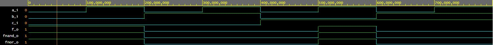

# Lab 01 - Gates

## Část 1 - GitHub:
**Zde je odkaz na můj git repozítář:** [MyGitHub](https://github.com/Heretic2k20/Digital-Electronics-1)

## Část 2 - De Morganova pravidla: 

**Pravidla:**

*f(c;b;a) = not(b).a + not(c).not(b)*

*f(c;b;a)nand = not{not[not(b).a] . not[not(c).not(b)]}*

*f(c;b;a)nor = not[b + not(a)] + not[c + b]*

------------------------------------------------------------------------
### Požadované části zdrojového kódu:
------------------------------------------------------------------------

***Popis "Black-boxu" (Vstupů a výstupů):***

     port(     
        a_i     : in  std_logic;         -- Data input        
        b_i     : in  std_logic;         -- Data input        
        c_i     : in  std_logic;         -- Data input        
        f_o     : out std_logic;         -- OR output function        
        fnand_o : out std_logic;         -- AND output function        
        fnor_o  : out std_logic          -- NOR output function        
    );

***Architektura (Implementace vzorců):***

    f_o     <= ((not b_i) and a_i) or ((not c_i) and (not b_i));    
    fnand_o <= not ((not ((not b_i) and a_i)) and (not ((not c_i) and (not b_i))));    
    fnor_o  <= not (b_i or (not a_i)) or (not (c_i or b_i));
    

#### Odkaz na zdrojový kód s možností spustit simulaci: [GatesSourceCode](https://www.edaplayground.com/x/wtbF)

------------------------------------------------------------------------
### Výstup:
------------------------------------------------------------------------

------------------------------------------------------------------------
### Tabulka zjištěných hodnot:
------------------------------------------------------------------------
| **c** | **b** |**a** | **f(c,b,a)** |
| :-: | :-: | :-: | :-: |
| 0 | 0 | 0 | **1** |
| 0 | 0 | 1 | **1** |
| 0 | 1 | 0 | **0** |
| 0 | 1 | 1 | **0** |
| 1 | 0 | 0 | **0** |
| 1 | 0 | 1 | **1** |
| 1 | 1 | 0 | **0** |
| 1 | 1 | 1 | **0** |

## Část 3 - Distribuční funkce a jejich užití: 

**Pravidla:**

*x.y + x.z = x.(y+z)*

*(x + y).(x + z) = x + (y . z)*

------------------------------------------------------------------------
### Požadované části zdrojového kódu:
------------------------------------------------------------------------

***Popis "Black-boxu" (Vstupů a výstupů):***

    port( 
        x_i     : in  std_logic;         -- Data input
        y_i     : in  std_logic;         -- Data input
        z_i     : in  std_logic;         -- Data input
        f1_left : out std_logic;         -- left output function
        f1_right: out std_logic;          -- right output function
        f1_left : out std_logic;         -- left output function
        f1_right: out std_logic          -- right output function
    );
    
***Architektura (Implementace vzorců):***

    f1_left  <= (x_i and y_i) or (x_i and z_i);
    f1_right <= x_i and (y_i or z_i);
    f2_left  <= (x_i or y_i) and (x_i or z_i);
    f2_right <= x_i or (y_i and z_i)

end entity gates;
#### Odkaz na zdrojový kód s možností spustit simulaci: [DistribucniFunkce-SourceCode](https://www.edaplayground.com/x/N_B9)

###### (xhynst03 - VUT FEKT  |  15.02.2021)
