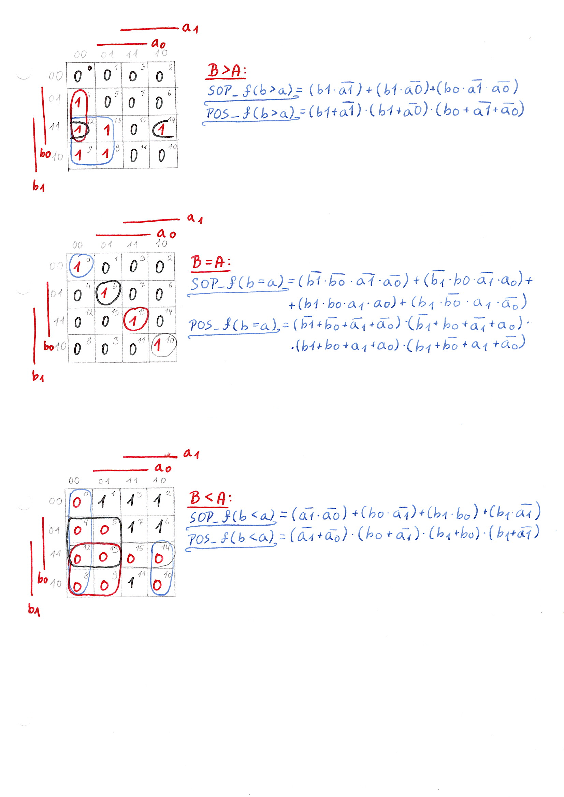

# Lab 02 - Logic

## Část 1 - Příprava:
**Tabulka připravená před cvičením:**

| **n** | **B[1:0]** | **A[1:0]** | **B > A** | **B = A** | **B < A** |
| :-: | :-: | :-: | :-: | :-: | :-: |
| 0 | 0 0 | 0 0 | 0 | 1 | 0 |
| 1 | 0 0 | 0 1 | 0 | 0 | 1 |
| 2 | 0 0 | 1 0 | 0 | 0 | 1 |
| 3 | 0 0 | 1 1 | 0 | 0 | 1 |
| 4 | 0 1 | 0 0 | 1 | 0 | 0 |
| 5 | 0 1 | 0 1 | 0 | 1 | 0 |
| 6 | 0 1 | 1 0 | 0 | 0 | 1 |
| 7 | 0 1 | 1 1 | 0 | 0 | 1 |
| 8 | 1 0 | 0 0 | 1 | 0 | 0 |
| 9 | 1 0 | 0 1 | 1 | 0 | 0 |
| 10 | 1 0 | 1 0 | 0 | 1 | 0 |
| 11 | 1 0 | 1 1 | 0 | 0 | 1 |
| 12 | 1 1 | 0 0 | 1 | 0 | 0 |
| 13 | 1 1 | 0 1 | 1 | 0 | 0 |
| 14 | 1 1 | 1 0 | 1 | 0 | 0 |
| 15 | 1 1 | 1 1 | 0 | 1 | 0 |

**Funkce pro B = A:**

*f(b=a) = [not(b1).not(b0).not(a1).not(a0)] + [not(b1).b0.not(a1).a0] + [b1.not(b0).a1.not(a0)] + [b1.b0.a1.a0]*

**Funkce pro B < A:**

*f(b<a) = [b1 + b0 + a1 + a0] . [b1 + not(b0) + a1 + a0] . [b1 + not(b0) + a1 + not(a0)] . [not(b1) + b0 + a1 + a0] . [not(b1) + b0 + a1 + not(a0)] . [not(b1) + b0 + not(a1) + a0] . [not(b1) + (notb0) + a1 + a0] . [not(b1) + not(b0) + a1 + not(a0)] . [not(b1) + not(b0) + not(a1) + a0] . [not(b1) + not(b0) + not(a1) + not(a0)]*

## Část 2 - Karnaughovy mapy a zjednodušené logické funkce:

## Část 3 - Binární komparátor:

### Design.VHD

***Popis "Black-boxu" (Vstupů a výstupů):***

	entity comparator_4bit is
    		port(
    
       	 		a_i         : in  std_logic_vector(4 - 1 downto 0);
       	 		b_i         : in  std_logic_vector(4 - 1 downto 0);
        		B_smo_A_o	: out std_logic;    --smooler
        		B_equ_A_o	: out std_logic;	--equals
        		B_big_A_o	: out std_logic		--bigger
        
    		);
	end entity comparator_4bit;

***Architektura (Implementace vzorců):***

	architecture Behavioral of comparator_4bit is
		begin

   			B_smo_A_o  <= '1' when (b_i < a_i) else '0';	--smooler
   			B_equ_A_o  <= '1' when (b_i = a_i) else '0';	--equals
    			B_big_A_o  <= '1' when (b_i > a_i) else '0';	--bigger
    
		end architecture Behavioral;
	
**Testbench.vhd**

	architecture testbench of tb_comparator_4bit is

   	-- Local signals
    
   		signal s_a     		: std_logic_vector(4 - 1 downto 0);
    		signal s_b      	: std_logic_vector(4 - 1 downto 0);
    		signal s_B_smo_A  	: std_logic;	--smooler
    		signal s_B_equ_A  	: std_logic;	--equals
		signal s_B_big_A 	: std_logic;	--bigger

	
	begin
   	 -- Connecting testbench signals with comparator_2bit entity (Unit Under Test)
    
  	uut_comparator_4bit : entity work.comparator_4bit
        port map(
        
            a_i         => s_a,
            b_i         => s_b,
            B_smo_A_o 	=> s_B_smo_A,	--smooler
            B_equ_A_o  	=> s_B_equ_A,	--equals
            B_big_A_o 	=> s_B_big_A	
            
        );
    --------------------------------------------------------------------
    -- Data generation process
    --------------------------------------------------------------------
    p_stimulus : process
    	begin
        	-- Report a note at the beginning of stimulus process
        	report "Stimulus process started" severity note;
       
       	 	-- WRITE OTHER TEST CASES HERE
        
        	--01
        
        	s_b <= "0000"; s_a <= "0000"; wait for 100 ns;
        
        	assert ((s_B_big_A = '0') and (s_B_equ_A = '1') and (s_B_smo_A = '0'))
        	report "Error appeared for input: 0000, 0000" severity error;
        
        	--02
        
        	s_b <= "0100"; s_a <= "0001"; wait for 100 ns;
        
        	assert ((s_B_big_A = '1') and (s_B_equ_A = '1') and (s_B_smo_A = '0'))
        	report "Error appeared for input: 0100, 0001" severity error;
        
        	--03
       
        	s_b <= "0100"; s_a <= "0010"; wait for 100 ns;
        
        	assert ((s_B_big_A = '1') and (s_B_equ_A = '0') and (s_B_smo_A = '0'))
        	report "Error appeared for input: 0100, 0010" severity error;
        
        	--04
        
       		s_b <= "0100"; s_a <= "0011"; wait for 100 ns;
        
        	assert ((s_B_big_A = '1') and (s_B_equ_A = '0') and (s_B_smo_A = '1'))
        	report "Error appeared for input: 0100, 0011" severity error;
		
        	--05
        
		s_b <= "0101"; s_a <= "0100"; wait for 100 ns;
        
        	assert ((s_B_big_A = '0') and (s_B_equ_A = '0') and (s_B_smo_A = '0'))
        	report "Error appeared for input: 0101, 0100" severity error;
        
        	--06
        
        	s_b <= "0101"; s_a <= "0101"; wait for 100 ns;
        
        	assert ((s_B_big_A = '0') and (s_B_equ_A = '1') and (s_B_smo_A = '0'))
        	report "Error appeared for input: 0101, 0101" severity error;
        
        	--07
        
        	s_b <= "0101"; s_a <= "0110"; wait for 100 ns;
        
        	assert ((s_B_big_A = '0') and (s_B_equ_A = '0') and (s_B_smo_A = '1'))
        	report "Error appeared for input: 0101, 0110" severity error;
        
        	--08
        
        	s_b <= "0101"; s_a <= "0111"; wait for 100 ns;
        
        	assert ((s_B_big_A = '0') and (s_B_equ_A = '0') and (s_B_smo_A = '1'))
        	report "Error appeared for input: 0101, 0111" severity error;
        
        	--09
        
        	s_b <= "1110"; s_a <= "0100"; wait for 100 ns;
        
        	assert ((s_B_big_A = '1') and (s_B_equ_A = '0') and (s_B_smo_A = '0'))
        	report "Error appeared for input: 1110, 0100" severity error;
        
        	--10
        
        	s_b <= "1110"; s_a <= "0101"; wait for 100 ns;
        
        	assert ((s_B_big_A = '1') and (s_B_equ_A = '0') and (s_B_smo_A = '0'))
        	report "Error appeared for input: 1110, 0101" severity error;
        
        	--11
        
        	s_b <= "1110"; s_a <= "0110"; wait for 100 ns;
        
        	assert ((s_B_big_A = '1') and (s_B_equ_A = '0') and (s_B_smo_A = '0'))
        	report "Error appeared for input: 1110, 0110" severity error;
        
        	--12
        
        	s_b <= "1110"; s_a <= "0111"; wait for 100 ns;
        
        	assert ((s_B_big_A = '1') and (s_B_equ_A = '0') and (s_B_smo_A = '0'))
        	report "Error appeared for input: 1110, 0111" severity error;
        
        	--13
        
        	s_b <= "1111"; s_a <= "0100"; wait for 100 ns;
        
       	 	assert ((s_B_big_A = '1') and (s_B_equ_A = '0') and (s_B_smo_A = '0'))
        	report "Error appeared for input: 1111, 0100" severity error;
        
        	--14
        
        	s_b <= "1111"; s_a <= "1101"; wait for 100 ns;
        
        	assert ((s_B_big_A = '1') and (s_B_equ_A = '0') and (s_B_smo_A = '0'))
        	report "Error appeared for input: 1111, 1101" severity error;
        	
        	--15
        
        	s_b <= "1111"; s_a <= "1110"; wait for 100 ns;
        
        	assert ((s_B_big_A = '1') and (s_B_equ_A = '0') and (s_B_smo_A = '0'))
        	report "Error appeared for input: 1111, 1110" severity error;
        
        	--16
        
        	s_b <= "1111"; s_a <= "1111"; wait for 100 ns;
        
        	assert ((s_B_big_A = '0') and (s_B_equ_A = '1') and (s_B_smo_A = '0'))
        	report "Error appeared for input: 1111, 1111" severity error;

        	-- Report a note at the end of stimulus process
        	report "Stimulus process finished" severity note;
        	wait;
    	end process p_stimulus;

	end architecture testbench;

