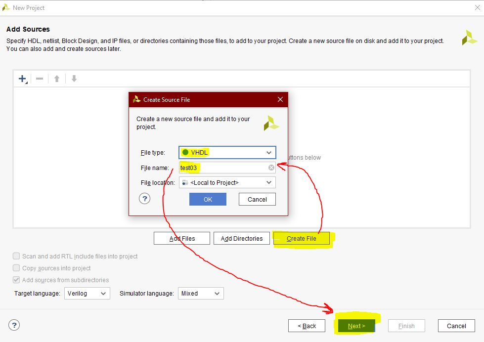

# Lab 03 - VIVADO


## Část 1 - Příprava:
**Tabulka připravená před cvičením:**

| **LED** | **Connection** | **Switch** | **Connection** | 
| :-: | :-: | :-: | :-: |
| LED0 | H17 | SW0 | J15 |
| LED1 | K15 | SW1 | L16 |
| LED2 | J13 | SW2 | M13 |
| LED3 | N14 | SW3 | R15 |
| LED4 | R18 | SW4 | R17 |
| LED5 | V17 | SW5 | T18 |
| LED6 | U17 | SW6 | U18 |
| LED7 | U16 | SW7 | R13 |
| LED8 | V16 | SW8 | T8 |
| LED9 | T15 | SW9 | U8 |
| LED10 | U14 | SW10 | R16 |
| LED11 | T16 | SW11 | T13 |
| LED12 | V15 | SW12 | H6 |
| LED13 | V14 | SW13 | U12 |
| LED14 | V12 | SW14 | U11 |
| LED15 | V11 | SW15 | V10 |


## Část 2 - Tutorial tvorby Vivado projektu:

------------------------------------------------------------------------
#### Nový projekt
------------------------------------------------------------------------

**1~** *File --> Project --> New --> Next*


**2~** *Next*


**3~** *Project_Name  -->  Next*


**4~** *RTL Project  -->  Next*



**5~** *Create_File  -->  File_Name  -->  VHDL  -->  OK   -->  Next*


**6~** *Next*


**7~** *Boards  -->  Choose_Mother_Board  -->  Next*


**8~** *Finish  -->  Pop-up window  -->  Yes  --> Another pop-up window  -->  OK  -->  Another pop-up window  -->  Yes*


------------------------------------------------------------------------
#### Nový zdrojový soubor simulace
------------------------------------------------------------------------

**9~** *File  -->  Add_Sources  -->  Add or create simulation sources  -->  Next*


**10~** *Create_File  -->  File_Name  -->  VHDL  -->  OK  -->  FINISH  -->  OK  -->  Pop-up window  -->  Yes*


**11~** *DONE*


## Část 3 - KÓD:

------------------------------------------------------------------------
### Architectura:
------------------------------------------------------------------------

```vhdl
  architecture Behavioral of mux_2bit_4to1 is
begin

    f_o <= a_i when (sel_i = "00") else
           b_i when (sel_i = "01") else
           c_i when (sel_i = "10") else
           d_i;

end Behavioral;
```

------------------------------------------------------------------------
### Proces:
------------------------------------------------------------------------
```vhdl
p_stimulus : process
    begin
        -- Report a note at the begining of stimulus process
        report "Stimulus process started" severity note;

        s_d <= "00"; s_c <= "01"; s_b <= "01"; s_a <= "01"; s_sel <= "00"; wait for 50 ns;
        
        s_a <= "00"; wait for 50 ns;
        s_b <= "11"; wait for 50 ns;
        
        s_sel <= "01"; wait for 50 ns;
        s_c <= "01"; wait for 50 ns;
        s_b <= "10"; wait for 50 ns;  
        
        s_d <= "11";  s_c <= "11"; s_b <= "01"; s_a <= "00"; 
        s_sel <= "10"; wait for 50 ns;  
        
        s_d <= "01";  s_c <= "00"; s_b <= "00"; s_a <= "01"; 
        s_sel <= "11"; wait for 50 ns;  
        
        s_d <= "11";  s_c <= "11"; s_b <= "01"; s_a <= "00"; 
        s_sel <= "10"; wait for 50 ns; 
               
        -- Report a note at the end of stimulus process
        report "Stimulus process finished" severity note;
        wait;
    end process p_stimulus;
```

------------------------------------------------------------------------
### Výsledek Simulace:
------------------------------------------------------------------------


###### (xhynst03 - VUT FEKT  |  04.03.2021)
