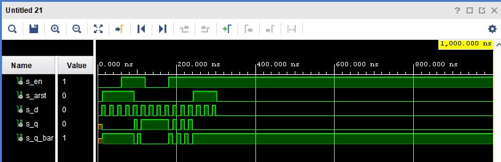
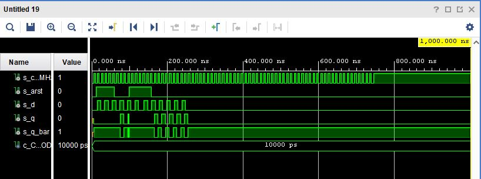
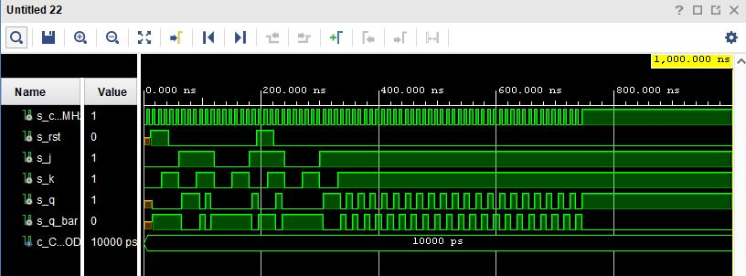
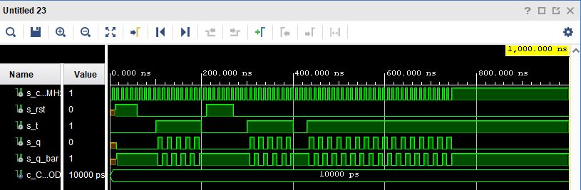
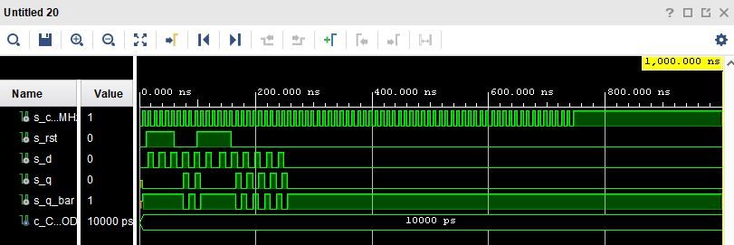
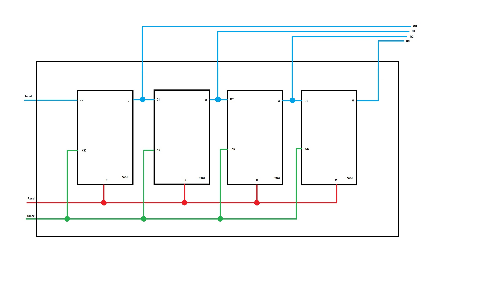

# Lab 07 - Flips Flops


## Část 1 - Domácí příprava:
------------------------------------------------------------------------

**Tabulky:**

*Q(n+1) = d*

   | **clk** | **d** | **q(n)** | **q(n+1)** | **Comments** |
   | :-: | :-: | :-: | :-: | :-- |
   | 0 | 0 | 0 | 0 | Vzorkovány a uloženy   |
   | 0 | 0 | 1 | 0 | Vzorkovány a uloženy   |
   | 1 | 1 | 0 | 1 | Vzorkovány a uloženy   |
   | 1 | 1 | 1 | 1 | Vzorkovány a uloženy   |
   
   
*Q(n + 1) = j . (not Qn) + (not k) . Qn* 
   
   | **clk** | **j** | **k** | **q(n)** | **q(n+1)** | **Comments** |
   | :-: | :-: | :-: | :-: | :-: | :-- |
   | 0 | 0 | 0 | 0 | 0 | Beze změny  |  
   | 0 | 0 | 0 | 1 | 1 | Beze změny  |
   | 0 | 0 | 0 | 1 | 0 | Reset       |
   | 0 | 0 | 1 | 1 | 0 | Reset       |
   | 1 | 1 | 0 | 0 | 1 | Set         |
   | 1 | 1 | 0 | 1 | 1 | Set         |
   | 1 | 1 | 1 | 0 | 1 | Toggle      |
   | 1 | 1 | 1 | 1 | 0 | Toggle      |
   
   
*Q(n+1) = t . (not Qn) + (not t) . Qn*
   
   | **clk** | **t** | **q(n)** | **q(n+1)** | **Comments** |
   | :-: | :-: | :-: | :-: | :-- |
   | 0 | 0 | 0 | 0 | Beze změny        |
   | 0 | 0 | 1 | 1 | Beze změny 	     |
   | 1 | 1 | 0 | 1 | Invertovaný       |
   | 1 | 1 | 1 | 0 | Invertovaný       |
   
   
   ## Část 2 - Kódy Latch:
------------------------------------------------------------------------

### d_latch.vhdl:
------------------------------------------------------------------------

```vhdl

library IEEE;
use IEEE.STD_LOGIC_1164.ALL;

entity d_latch is

  Port ( 
         en     : in std_logic;
         arst   : in std_logic;
         d      : in std_logic;
         q      : out std_logic;
         q_bar  : out std_logic  
  );
  
end d_latch;

architecture Behavioral of d_latch is

begin

    p_d_latch : process (d, arst, en)
    begin
    
        if (arst = '1') then
            q <= '0';
            q_bar <= '1';
       
        elsif (en = '1') then
            q <= d;
            q_bar <= not d;   
        
        end if; 
          
    end process p_d_latch;  
     
end Behavioral;

```

### tb_d_latch.vhdl:
------------------------------------------------------------------------

```vhdl
library IEEE;
use IEEE.STD_LOGIC_1164.ALL;

entity tb_d_latch is
 -- Port (  );
end tb_d_latch;

architecture Behavioral of tb_d_latch is
        signal s_en     :  std_logic;
        signal s_arst   :  std_logic;
        signal s_d      :  std_logic;
        signal s_q      :  std_logic;
        signal s_q_bar  :  std_logic;

begin

uut_d_latch: entity work.d_latch
    port map(
        en    => s_en,   
        arst  => s_arst, 
        d     => s_d,    
        q     => s_q,    
        q_bar => s_q_bar
);

p_reset_gen : process
    begin
        s_arst <= '0';
        wait for 12 ns;
        
        s_arst <= '1';
        wait for 80 ns;
       
        
        s_arst <= '0';
        wait for 150 ns;
        
        s_arst <= '1';
        wait for 60 ns;
       
        s_arst <= '0';
        wait;
    end process p_reset_gen;
    
    p_stimulus : process
    begin
        report "Stimulus process started" severity note;
            s_d <= '0';
            s_en <= '0';
            
            
            assert (s_q = '0')
            report "nesouhlasí" severity error;
            
            
            wait for 10ns;
            s_d <= '1';
            wait for 10ns;
            s_d <= '0';
            wait for 10ns;
            s_d <= '1';
            wait for 10ns;
            s_d <= '0';
            wait for 10ns;
            s_d <= '1';
            wait for 10ns;
            s_d <= '0';
            
            assert (s_q = '0' and s_q_bar = '1')
            report "nesouhlasí" severity error;
            
            
            s_en <= '1';

            wait for 10ns;
            s_d <= '1';
            wait for 10ns;
            s_d <= '0';
            wait for 10ns;
            s_d <= '1';
            wait for 10ns;
            s_d <= '0';
            wait for 10ns;
            s_d <= '1';
            wait for 10ns;
            s_d <= '0';
            
            s_en <= '0';
            
            
            wait for 10ns;
            s_d <= '1';
            wait for 10ns;
            s_d <= '0';
            wait for 10ns;
            s_d <= '1';
            wait for 10ns;
            s_d <= '0';
            wait for 10ns;
            s_d <= '1';
            wait for 10ns;
            s_d <= '0';    
            
            s_en <= '1';
            
            wait for 10ns;
            s_d <= '1';
            wait for 10ns;
            s_d <= '0';
            wait for 10ns;
            s_d <= '1';
            wait for 10ns;
            s_d <= '0';
            wait for 10ns;
            s_d <= '1';
            wait for 10ns;
            s_d <= '0'; 
            wait for 10ns;
            s_d <= '1';
            wait for 10ns;
            s_d <= '0';
            wait for 10ns;
            s_d <= '1';
            wait for 10ns;
            s_d <= '0';
            wait for 10ns;
            s_d <= '1';
            wait for 10ns;
            s_d <= '0'; 
    
    report "Stimulus process finished" severity note;
        wait;
    end process p_stimulus;

end Behavioral;
```


### Výsledky simulace rb_d_latch:
------------------------------------------------------------------------




   ## Část 3 - Flip Flops:
------------------------------------------------------------------------

### d_ff_arts:
------------------------------------------------------------------------

```vhdl

use IEEE.STD_LOGIC_1164.ALL;

entity d_ff_arst is
  Port ( 
         clk     : in std_logic;
         arst   : in std_logic;
         d      : in std_logic;
         q      : out std_logic;
         q_bar  : out std_logic
         );
end d_ff_arst;

architecture Behavioral of d_ff_arst is

begin

     p_d_latch : process (arst, clk)
     
    begin    
    
        if (arst = '1') then
            q <= '0';
            q_bar <= '1';
       
        elsif rising_edge(clk) then
            q <= d;
            q_bar <= not d;   
        
        end if; 
          
    end process p_d_latch;  

end Behavioral;

```

### d_ff_rts:
------------------------------------------------------------------------

```vhdl

library IEEE;
use IEEE.STD_LOGIC_1164.ALL;

entity d_ff_rst is
  Port ( 
        clk  : in std_logic;
        rst  : in std_logic;
        d    : in std_logic;
        q    : out std_logic;
        q_bar:out std_logic
        
  );    
end d_ff_rst;

architecture Behavioral of d_ff_rst is

begin
p_d_ff_rst : process (clk)

    begin
    
        if rising_edge(clk) then
           
            if (rst = '1')then
                q <= '0';
                q_bar <= '1';
            else
                q <= d;
                q_bar <= not d;
                
            end if;
             
        end if; 
        
end process p_d_ff_rst;


end Behavioral;
```

### jk_ff_rts:
------------------------------------------------------------------------

```vhdl

library IEEE;
use IEEE.STD_LOGIC_1164.ALL;


entity jk_ff_rst is
  Port ( 
         clk    : in std_logic;
         rst    : in std_logic;
         j      : in std_logic;
         k      : in std_logic;
         q      : out std_logic;
         q_bar  : out std_logic
  );
end jk_ff_rst;

architecture Behavioral of jk_ff_rst is

    signal s_q : std_logic;

begin

 p_d_latch : process (clk)
 
    begin
    
        if rising_edge(clk) then
           
            if (rst = '1')then
                s_q <= '0';
            
            else
                
                if (j = '0' and k = '0')then
                    s_q <= s_q;
               
                elsif (j = '0' and k = '1')then  
                    s_q <= '0';
              
                elsif (j = '1' and k = '0')then 
                    s_q <= '1';
              
                elsif (j = '1' and k = '1')then  
                    s_q <= not s_q;                 
                
                end if;
             
            end if;
             
        end if; 
          
    end process p_d_latch; 

    q <= s_q;
    q_bar <= not s_q;

end Behavioral;

```

### t_ff_rts:
------------------------------------------------------------------------

```vhdl

library IEEE;
use IEEE.STD_LOGIC_1164.ALL;

entity t_ff_rst is
  Port ( 
         clk     : in std_logic;
         rst   : in std_logic;
         t      : in std_logic;
         q      : out std_logic;
         q_bar  : out std_logic
  );
  
end t_ff_rst;

architecture Behavioral of t_ff_rst is

    signal s_q : std_logic;

begin

 p_t_ff_rst : process (clk)
 
    begin
    
        if rising_edge(clk) then
           
            if (rst = '1')then
                s_q <= '0';
            
            else
                
                if (t = '0')then
                    s_q <= s_q;
               
                elsif (t = '1')then  
                    s_q <= not s_q;                 
                
                end if;
             
            end if;
             
        end if; 
          
    end process p_t_ff_rst; 

    q <= s_q;
    q_bar <= not s_q;


end Behavioral;

```

### clock, reset a stimulus process z tb_jk_ff:
------------------------------------------------------------------------

```vhdl

  p_clk_gen : process
        
    begin
    
        while now < 750 ns loop         -- 75 periods of 100MHz clock
            s_clk_100MHz <= '0';
            wait for c_CLK_100MHZ_PERIOD / 2;
            s_clk_100MHz <= '1';
            wait for c_CLK_100MHZ_PERIOD / 2;
            
        end loop;
        
        wait;
    end process p_clk_gen;

p_reset_gen : process

    begin
        s_arst <= '0';
        wait for 12 ns;
        
        -- Reset activated
        s_arst <= '1';
        wait for 48 ns;
       
        
        s_arst <= '0';
        wait for 38 ns;
        
        -- Reset activated
        s_arst <= '1';
        wait for 60 ns;
       
        s_arst <= '0';
        wait;
        
    end process p_reset_gen;

    begin
    
        report "Stimulus process started" severity note;
        
            s_d <= '0';                     
            
            wait for 14ns;
            s_d <= '1';
            wait for 10ns;
            s_d <= '0';
            
            wait for 6ns;
            s_d <= '0';
            
            assert (s_q = '0' and s_q_bar = '1')
            report "nesouhlasí" severity error;
            
            
            wait for 4ns;
            s_d <= '1';
            wait for 10ns;
            s_d <= '0';
            wait for 10ns;
            s_d <= '1';
            wait for 10ns;
            s_d <= '0'; 
            wait for 10ns;
            s_d <= '1';
            wait for 10ns;
            s_d <= '0';
            wait for 10ns;
            s_d <= '1';
            wait for 10ns;
            s_d <= '0';
            wait for 10ns;
            s_d <= '1';
            wait for 10ns;
            s_d <= '0'; 
            wait for 14ns;
            s_d <= '1';
            wait for 10ns;
            s_d <= '0';
            wait for 10ns;
            s_d <= '1';
            wait for 10ns;
            s_d <= '0';
            wait for 10ns;
            s_d <= '1';
            wait for 10ns;
            s_d <= '0'; 
            wait for 10ns;
            s_d <= '1';
            wait for 10ns;
            s_d <= '0';
            wait for 10ns;
            s_d <= '1';
            wait for 10ns;
            s_d <= '0';
            wait for 10ns;
            s_d <= '1';
            wait for 10ns;
            s_d <= '0'; 
    
    report "Stimulus process finished" severity note;
        wait;
        
    end process p_stimulus;
    
end Behavioral;

```

### tb_d_ff_arst:
------------------------------------------------------------------------


### tb_jk_ff_rst:
------------------------------------------------------------------------


### tb_t_ff_rst:
------------------------------------------------------------------------


### tb_d_ff_rst:
------------------------------------------------------------------------


   ## Část 4 - Schéma:
------------------------------------------------------------------------


   
   ###### (xhynst03 - VUT FEKT  |  30.03.2021)
  
