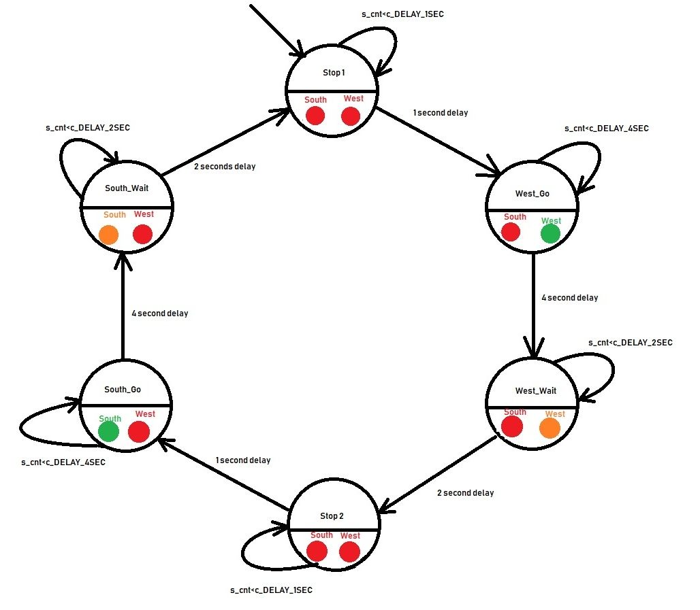
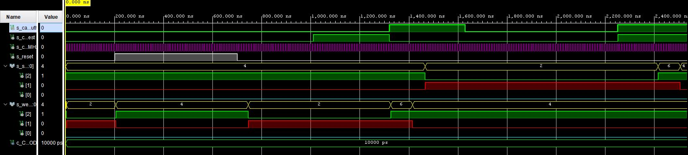
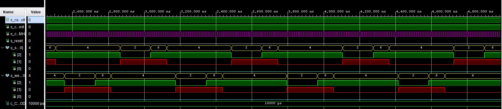

# Lab 08 - Traffic Lights


## Část 1 - Příprava:

**Předpřipravené tabulky**

| **Input P** | `0` | `0` | `1` | `1` | `0` | `1` | `0` | `1` | `1` | `1` | `1` | `0` | `0` | `1` | `1` | `1` |
| :-: | :-: | :-: | :-: | :-: | :-: | :-: | :-: | :-: | :-: | :-: | :-:| :-: | :-: | :-: | :-: | :-: |
| **State** | A | A | B | C | C | D | A | B | C | D | B | B | B | C | D | B |
| **Output R** | `0` | `0` | `0` | `0` | `0` | `1` | `0` | `0` | `0` | `1` | `0` | `0` | `0` | `0` | `1` | `0` |

| **RGB LED** | **Artix-7 pin names** | **Red** | **Yellow** | **Green** |
| :-: | :-: | :-: | :-: | :-: |
| LD16 | N15, M16, R12 | `1,0,0` | `1,1,0` | `0,1,0` |
| LD17 | N16, R11, G14 | `1,0,0` | `1,1,0` | `0,1,0` |

**Zapojení**


## Část 2 - Semafory:

**Stavový diagram**



### Process p_traffic_fsm

```vhdl
p_traffic_fsm : process(clk)
    begin
        if rising_edge(clk) then
            if (reset = '1') then
                s_state <= STOP1; 
                s_cnt   <= c_ZERO;     

            elsif (s_en = '1') then
                
                case s_state is

                    when STOP1 =>
                        if (s_cnt < c_DELAY_1SEC) then
                            s_cnt <= s_cnt + 1;
                        else
                            s_state <= WEST_GO;
                            
                            s_cnt   <= c_ZERO;
                        end if;

                    when WEST_GO =>
                        if (s_cnt < c_DELAY_4SEC) then
                            s_cnt <= s_cnt + 1;
                        else
                            s_state <= WEST_WAIT;
                            
                            s_cnt   <= c_ZERO;
                        end if;
                   
                    when WEST_WAIT =>
                        if (s_cnt < c_DELAY_2SEC) then
                            s_cnt <= s_cnt + 1;
                        else
                            s_state <= STOP2;
                            
                            s_cnt   <= c_ZERO;
                        end if;
                    
                    when STOP2 =>
                        if (s_cnt < c_DELAY_1SEC) then
                            s_cnt <= s_cnt + 1;
                        else
                            s_state <= SOUTH_GO;
                            
                            s_cnt   <= c_ZERO;
                        end if;

                    when SOUTH_GO =>
                        if (s_cnt < c_DELAY_4SEC) then
                            s_cnt <= s_cnt + 1;
                        else
                            s_state <= SOUTH_WAIT;
                            
                            s_cnt   <= c_ZERO;
                        end if;
                   
                    when SOUTH_WAIT =>
                        if (s_cnt < c_DELAY_2SEC) then
                            s_cnt <= s_cnt + 1;
                        else
                            s_state <= STOP1;
                            
                            s_cnt   <= c_ZERO;
                        end if;
                    
                    when others =>
                        s_state <= STOP1;

                end case;
            end if;
        end if;
    end process p_traffic_fsm;
```

### process p_output_fsm

```vhdl
p_output_fsm : process(s_state)
    begin
        case s_state is
            when STOP1 =>
                south_o <= "100";   -- Red
                west_o  <= "100";   -- Red
            
            when WEST_GO =>
                south_o <= "100";   -- Red
                west_o  <= "010";   -- Green
           
            when WEST_WAIT =>
                south_o <= "100";   -- Red
                west_o  <= "110";   -- Yellow
            
            when STOP2 =>
                south_o <= "100";   -- Red
                west_o  <= "100";   -- Red 
            
            when SOUTH_GO =>
                south_o <= "010";   -- Green 
                west_o  <= "100";   -- Red 
            
            when SOUTH_WAIT =>
                south_o <= "110";   -- Yellow 
                west_o  <= "100";   -- Red 

            when others =>
                south_o <= "100";   -- Red
                west_o  <= "100";   -- Red
        end case;
    end process p_output_fsm;
```

### Screenshot simulace






## Část 2 - Chytré řízení:

### Tabulky

| **Stav 00** | **Směr South** | **Směr West** | **Zpoždění** | 
| :-: | :-: | :-: | :-: |
| *SOUTH_GO* | Zelená | Červená | **-** | 
| *WEST_GO* | Červená | Zelená | **-** |
|  |  |  |  |
| **Stav 01** | **Směr South** | **Směr West** | **Zpoždění** | 
| *SOUTH_GO* | <span style="color: green">Zelená</span> | Červená | 0 sec | 
| *WEST_GO* | Červená | Červená |  2 sec |
| *SOUTH_WAIT* | Oranžová | Červená | 1 sec | 
| *STOP1* | Červená | Červená | **-** |
|  |  |  |  |
| **Stav 11** | **Směr South** | **Směr West** | **Zpoždění** | 
| *SOUTH_GO* | Zelená | Červená | 4 sec | 
| *WEST_GO* | Červená | Zelená |  4 sec |
| *SOUTH_WAIT* | Oranžová | Červená | 2 sec | 
| *WEST_WAIT* | Červená | Oranžová | 2 sec | 
| *STOP1* | Červená | Červená | 1 sec |
| *STOP2* | Červená | Červená | 1 sec |
|  |  |  |  |
| **Stav 10** | **Směr South** | **Směr West** | **Zpoždění** | 
| *SOUTH_GO* | Zelená | Červená | **-** | 
| *WEST_GO* | Červená | Zelená |  0 sec |
| *WEST_WAIT* | Červená | Oranžová | 2 sec | 
| *STOP2* | Červená | Červená | 1 sec |


### Schéma

**Process p_smart_traffic_fsm**

```vhdl
p_smart_traffic_fsm : process(clk)
    begin
        if rising_edge(clk) then
            if (reset = '1') then      
                s_state <= STOP1 ;  
                s_cnt   <= c_ZERO;    

            elsif (s_en = '1') then
                
                case s_state is

                    when STOP1 =>
                        
                        if (s_cnt < c_DELAY_1SEC) then
                            s_cnt <= s_cnt + 1;
                        else
                            s_state <= WEST_GO;
                            
                            s_cnt   <= c_ZERO;
                        end if;

                    when WEST_GO =>
                        if (car_south = '0' and car_west = '0') then
                            s_state <= WEST_GO;
                        
                        elsif (car_south = '0' and car_west = '1') then
                            s_state <= WEST_GO;
                        
                        elsif (car_south = '1' and car_west = '0') then
                            s_state <= WEST_WAIT;
                                
                            s_cnt   <= c_ZERO;
                        
                        elsif (car_south = '1' and car_west = '1') then
                            if (s_cnt < c_DELAY_4SEC) then
                                s_cnt <= s_cnt + 1;
                            else
                                s_state <= WEST_WAIT;
                                
                                s_cnt   <= c_ZERO;
                            end if;
                        end if; 
                   
                    when WEST_WAIT =>
                        if (s_cnt < c_DELAY_2SEC) then
                            s_cnt <= s_cnt + 1;
                        else
                            s_state <= STOP2;
                                
                            s_cnt   <= c_ZERO;
                        end if;
                                                
                    when STOP2 =>
                        if (s_cnt < c_DELAY_1SEC) then
                            s_cnt <= s_cnt + 1;
                        else
                            s_state <= SOUTH_GO;
                            
                            s_cnt   <= c_ZERO;
                        end if;

                    when SOUTH_GO =>
                        if (car_south = '0' and car_west = '0') then
                            s_state <= SOUTH_GO;
                        
                        elsif (car_south = '1' and car_west = '0') then
                            s_state <= SOUTH_GO;
                        
                        elsif (car_south = '0' and car_west = '1') then
                            s_state <= SOUTH_WAIT;
                                
                            s_cnt   <= c_ZERO;
                        
                        elsif (car_south = '1' and car_west = '1') then
                            if (s_cnt < c_DELAY_4SEC) then
                                s_cnt <= s_cnt + 1;
                            else
                                s_state <= SOUTH_WAIT;
                                
                                s_cnt   <= c_ZERO;
                            end if;
                        end if; 
                   
                    when SOUTH_WAIT =>
                        if (s_cnt < c_DELAY_2SEC) then
                            s_cnt <= s_cnt + 1;
                        else
                            s_state <= STOP1;
                            
                            s_cnt   <= c_ZERO;
                        end if;
                    
                     
                    when others =>
                        s_state <= STOP1;

                end case;
            end if; -- Synchronous reset
        end if; -- Rising edge
    end process p_smart_traffic_fsm;
```


###### (xhynst03 - VUT FEKT  |  15.02.2021)
